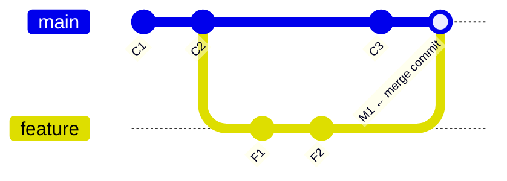
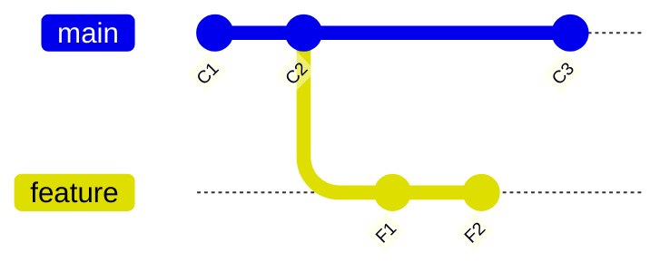
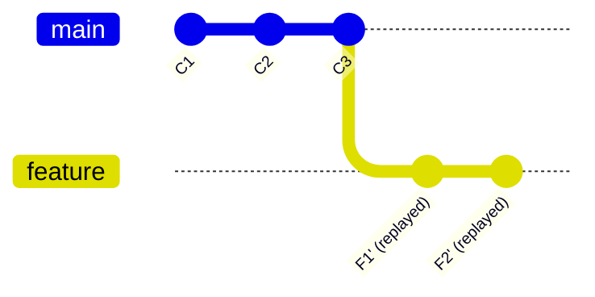
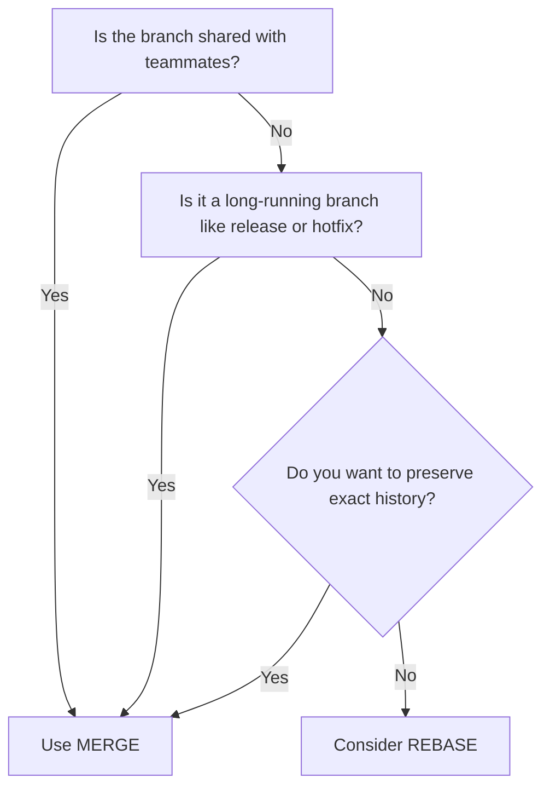
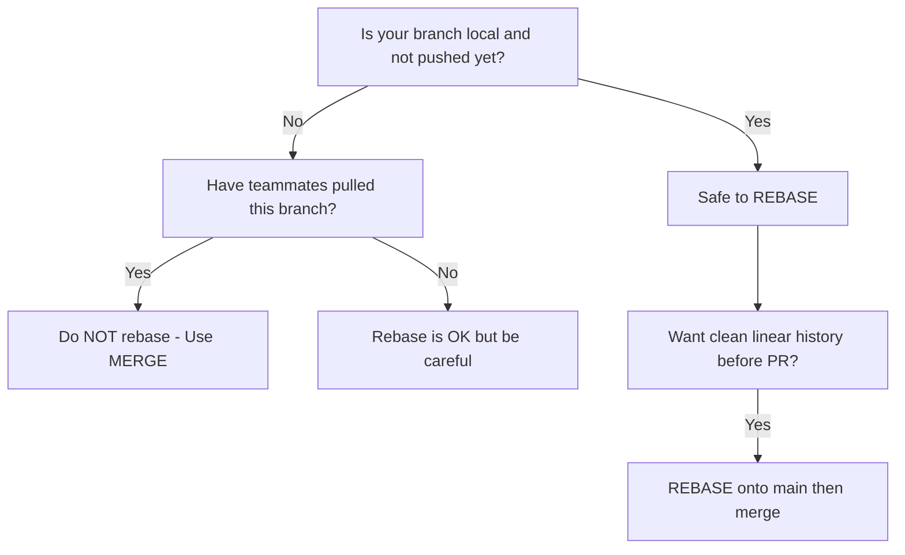
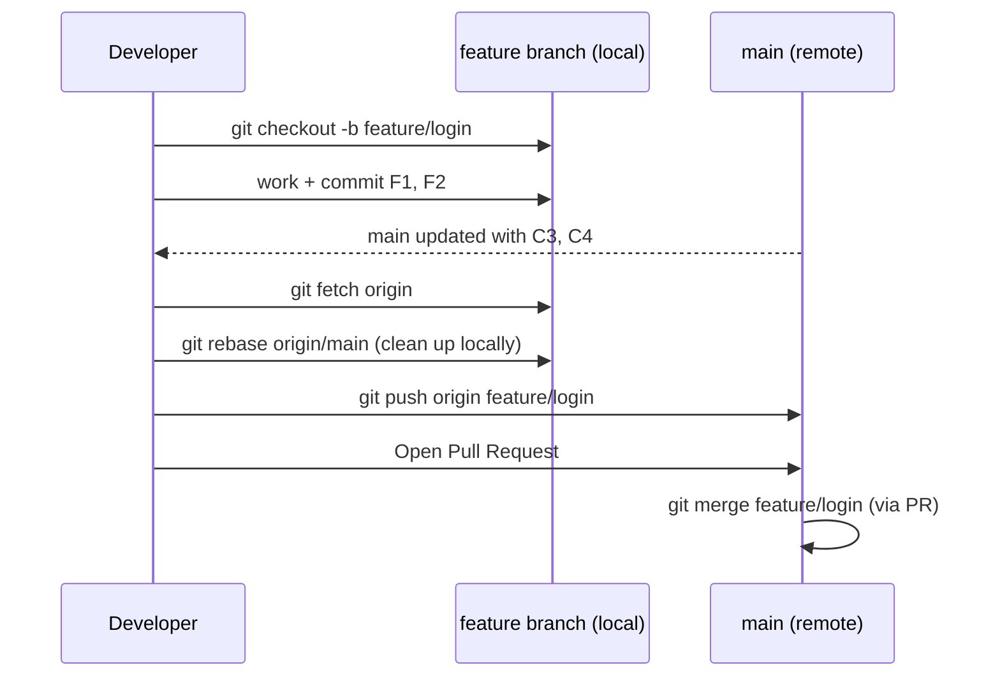

# Git Merge vs Rebase — Full Guide

---

## The Core Problem They Both Solve

When you're working on a `feature` branch and `main` moves ahead with new commits, you need to bring those changes in. **Merge** and **Rebase** are two ways to do that — with very different outcomes.

---

## Git Merge

Merge **combines two branches** by creating a new "merge commit" that ties their histories together. The original branch history is fully preserved.

### How it works



### What happens
- `main` had `C1 → C2 → C3`
- `feature` branched from `C2` and added `F1, F2`
- After `git merge feature`, a new merge commit `M1` is created on `main`
- Both lines of history are visible and preserved

### Commands
```bash
git checkout main
git merge feature
```

---

## Git Rebase

Rebase **moves your branch commits** to the tip of another branch. It replays your commits one by one on top of the target, creating new (rewritten) commits. The result is a **linear history** — as if your feature branch started from the latest point.

### How it works

**Before rebase:**


**After `git rebase main` (on feature branch):**


### What happens
- Your `F1` and `F2` commits are **rewritten** as `F1'` and `F2'` with new commit hashes
- They sit cleanly on top of `C3`
- No merge commit — history looks perfectly linear

### Commands
```bash
git checkout feature
git rebase main
```

---

## Side-by-Side Comparison

| Factor | `git merge` | `git rebase` |
|---|---|---|
| History style | Non-linear (preserves actual history) | Linear (clean, rewrites history) |
| Merge commit | Yes — creates one | No — no extra commit |
| Original commits preserved | Yes (same hashes) | No (new hashes are created) |
| Conflict handling | Resolve once at merge point | Resolve per commit during replay |
| Safe on shared branches | Yes | **No** — rewrites history |
| Traceability | Easy to see when branches diverged | Harder — looks like everything was sequential |
| Best for | Team branches, public branches | Local cleanup, feature branches |

---

## When to Prefer Merge



**Use Merge when:**
- Merging a `feature` branch into `main` / `develop` via a Pull Request
- The branch has already been pushed and shared with teammates
- You want a clear record of when two lines of work came together
- Working on `release`, `hotfix`, or any long-running shared branch
- Your team uses a merge-based workflow (GitHub Flow, GitFlow)

---

## When to Prefer Rebase



**Use Rebase when:**
- You want to clean up messy local commits before opening a PR
- Updating your local feature branch with latest `main` changes (before pushing)
- Squashing fixup commits into meaningful ones
- Keeping a linear, readable project history
- Working solo on a feature branch that hasn't been shared

---

## The Golden Rules

| Rule | Reason |
|---|---|
| **Never rebase a public/shared branch** | Rewriting history breaks everyone else's local copies |
| **Always rebase before you push** | Keep commits clean before sharing |
| **Always merge after a PR review** | Preserves the review trail and branch context |
| **Rebase locally, merge publicly** | Best of both worlds |

---

## Real-World Workflow (Recommended)



**Steps:**
```bash
# 1. Create feature branch
git checkout -b feature/login

# 2. Do your work and commit
git add .
git commit -m "add login form"

# 3. Main has moved ahead — update your branch cleanly
git fetch origin
git rebase origin/main

# 4. Push and open PR
git push origin feature/login

# 5. Team merges via PR (merge commit in main)
```

---

## Quick Decision Card

```
Is the branch already pushed and shared?
  YES → git merge
  NO  → git rebase (to stay up to date), then merge via PR
```
