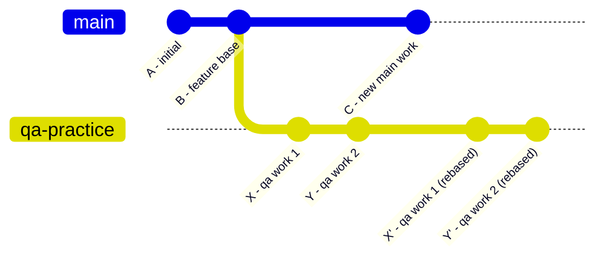

# Git Rebase Workflow — Learning Notes

## The Problem: Rebase + Pull = Duplicate Commits

When you rebase a branch that is already pushed to remote, then run `git pull`,
Git creates duplicate commits because rebase rewrites commit SHAs.

### What went wrong (real example from this repo)

```
*   73db6fe  ← MERGE COMMIT (caused by git pull after rebase)
|\
| * 3ffca0a  commit-4 updated commands info   ← REMOTE (old SHAs)
| * 7366738  created git-learning folder       ← REMOTE (old SHAs)
* | e4355cf  commit-4 updated commands info   ← LOCAL (new SHAs after rebase)
* | d1df272  created git-learning folder       ← LOCAL (new SHAs after rebase)
|/
* a1c39f8  (main) Added readme file
```

Same work — twice. This is the duplicate commit problem.

---

## The Correct Workflow

### Rebase your branch onto main (clean history)

```bash
# Step 1: Update main
git checkout main
git pull

# Step 2: Switch to your branch
git checkout qa-practice

# Step 3: Rebase onto main
git rebase main

# Step 4: Force-push (NOT git pull)
git push --force-with-lease
```

> **Golden Rule: Rebase → force-push. Never rebase → pull.**

---

## How to Check if Main Has New Changes

```bash
# Commits in main that qa-practice is missing
git log qa-practice..main --oneline

# Commits in qa-practice that main doesn't have
git log main..qa-practice --oneline

# File-level diff between branches
git diff main..qa-practice --name-only

# Fetch and check status
git fetch origin
git status
```

- Empty output from `git log qa-practice..main` → no rebase needed
- Has commits → main moved ahead, rebase before continuing

---

## Visual: How Rebase Works



After rebase, `X'` and `Y'` are new commits replayed on top of `C`.
The old `X` and `Y` still exist on the remote — that's why you must force-push.

---

## Rebase vs Merge: When to Use Which

| Situation                                | Use                           |
| ---------------------------------------- | ----------------------------- |
| Keeping your branch up to date with main | `git rebase main`             |
| Integrating a finished branch into main  | `git merge` (or PR)           |
| After rebase, updating remote            | `git push --force-with-lease` |
| Normal push (no rebase)                  | `git push`                    |

---

## Key Concepts

**`git rebase main`**
Replays your branch commits on top of the latest main commit.
New commits = new SHAs. Old commits on remote become orphans.

**`git push --force-with-lease`**
Overwrites remote history with your rebased version.
Safer than `--force` — fails if someone else pushed to the branch since your last fetch.

**Why NOT `git pull` after rebase?**
`git pull` = `git fetch` + `git merge`.
It sees two different histories (local rebased vs remote original) and merges them,
creating duplicate commits and an ugly merge commit.
